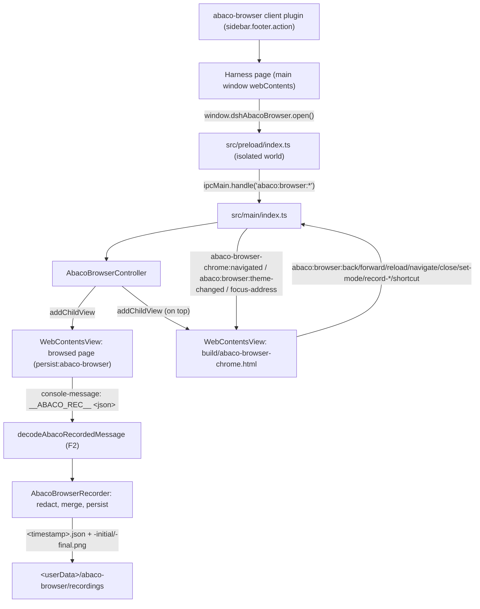

# Integrated browser (ABACO browser, F0 → F3)

F0 ships the smallest end-to-end slice of the integrated browser: a launcher in
the sidebar footer, an overlay `WebContentsView` inside the main window, a basic
chrome bar, and the IPC/preload seam between them.

F1 gives the **agent** the same browser: seven `abaco_browser_*` tools that
navigate, click, type, read the DOM, wait for selectors, screenshot and report
state — reaching the main process' overlay across a process boundary through a
loopback HTTP control plane, with an explicit agent/manual ownership switch.

F2 completes the **chrome** (loading state, page title next to the address,
accelerators, draggable strip, Harness theme) and fills the hole F0 left open:
the page half of the recorder emitted `console.log('__ABACO_REC__', json)` and
**nothing consumed `console-message`**, so user actions were never recorded. F2
adds the decoder, the injected listener script, the redaction layer, a merge
policy that turns the raw event stream into steps, and the on-disk recording
(`<userData>/abaco-browser/recordings/<timestamp>.json` + two PNGs) that F3 will
turn into a skill.

F3 is the far end of that pipeline: the 💾 button in the strip (and the
`abaco:browser:save-skill` channel behind it) compiles a finished recording into
a `SKILL.md` under `$DSH_HOME/skills/<slug>/`, which the Harness's own
`dsh-skill-filesystem` provider discovers on its next catalog pass — so the flow
the user demonstrated becomes something the **agent** can invoke, with no new
tool and no new discovery mechanism.

Status: F3 implemented, statically verified (`npm run typecheck` → 0 errors,
`vitest run test/abaco-browser.test.ts test/abaco-browser-recorder.test.ts
test/abaco-browser-skill.test.ts` → 80/80). No Electron build or app launch was
run for F0, F1, F2 or F3; the things only a launch can confirm are listed under
*Not verified by a launch*.

## Topology



The chat is never touched: the Harness renderer stays the window's own
`webContents`, and the overlay is added as sibling child views through
`window.contentView.addChildView(...)` — the mechanism `safe-mode-overlay.ts`
already uses for its backdrop and `attachWindowsMenuView` for the Windows menu.

## F1 topology

The agent's tools live in the **Harness Node child** (that is where `ctx.tools`
is); the overlay lives in **Electron main** (only it may create a
`WebContentsView`). Neither F0's renderer preload nor an IPC channel bridges
those two, so F1 adds a third surface:

```mermaid
flowchart LR
  TOOLS["abaco-browser plugin host half (Harness Node child):<br/>7 defineTool definitions"] -->|"POST /navigate /click /type /read-dom /wait-for /screenshot /state<br/>Authorization: Bearer token"| RPC["AbacoBrowserRpcServer<br/>127.0.0.1:&lt;ephemeral&gt;"]
  RPC --> GATE{"mode?"}
  GATE -->|agent| CTRL["AbacoBrowserController.agent*"]
  GATE -->|manual| REFUSE["409 + takeover message"]
  CTRL -->|"executeJavaScript / capturePage"| OVERLAY["browsed page"]
  MAIN["src/main/index.ts (bootstrap)"] -->|"start() before launchHarness()"| RPC
  MAIN -->|"extraEnvironment: () =&gt; rpc.environment()"| SPAWN["HarnessRuntime spawn"]
  SPAWN -->|"ABACO_BROWSER_CTRL_PORT / _TOKEN in child env"| TOOLS
```



Why HTTP on loopback rather than more IPC: the consumer is a **Node child**, not
a renderer, so there is no `ipcRenderer` to hand it and no way to add one. The
precedent is `mobile/lan-mobile-bridge.ts`, which already runs a loopback server
in main for the same reason (its client is a phone browser).

## F3 topology

```mermaid
flowchart LR
  STRIP["chrome bar: 💾 save as skill<br/>(+ optional name input)"] -->|"abaco:browser:save-skill { recordingId?, name? }"| MAIN["src/main/index.ts (handler)"]
  PAGE["Harness page: window.dshAbacoBrowser.saveSkill()"] -->|"same channel"| MAIN
  MAIN --> RES{"which recording?"}
  RES -->|"id given"| FILE["&lt;recordingsDir&gt;/&lt;id&gt;.json"]
  RES -->|"id omitted"| NEWEST["newest *.json in &lt;recordingsDir&gt;"]
  FILE --> WRITER["abaco-browser-skill-writer:<br/>parse → collapse → render"]
  NEWEST --> WRITER
  WRITER -->|"&lt;DSH_HOME&gt;/skills/&lt;slug&gt;/SKILL.md (0700/0600)"| SKILL["SKILL.md"]
  SKILL -->|"chokidar add / next catalog pass"| PROVIDER["dsh-skill-filesystem (user-dsh root)"]
  PROVIDER --> AGENT["agent's skill catalog"]
```



`DSH_HOME` is resolved the way the Harness resolves it — `$DSH_HOME` when the
environment sets it, otherwise the value the shell injects into the Harness child
(`<userData>/harness`, `src/main/runtime/harness-runtime.ts:271`). The layout
(`<dshHome>/skills/<dir>/SKILL.md`) is not a convention of ours: it is exactly
what `@deepseek-ai/dsh-skill-filesystem` scans
(`lib/index.js:171-180` for the root, `:550-557` for the file), and `name` +
`description` in the frontmatter are the two fields it refuses a skill without
(`:679-688`).

## Files

| Path | Role |
| --- | --- |
| `src/shared/abaco-browser.ts` | Channel names, partition, chrome height, URL normalization, the F1 contract (mode, agent result types, control-plane env names, RPC routes), the F2 contract (recording vocabulary, redaction rules, accelerator table, theme type) and the F3 contract (`saveSkill`, the skills-root and `SKILL.md` names, the save request/result pair, the fragile-selector table) |
| `src/main/abaco-browser-controller.ts` | Owns both overlay views, navigation commands, bounds sync, view-level security handlers, the takeover gate and the `agent*` actions, plus F2's `console-message` decoder subscription, recording start/stop, theme push and `before-input-event` accelerators |
| `src/main/abaco-browser-recorder.ts` | **F2:** the `__ABACO_REC__` parser, the redaction layer, the merge policy that turns events into steps, and the persisted session. Imports no `electron` — the page is reached through a three-method port |
| `src/main/abaco-browser-skill-writer.ts` | **F3:** reads a persisted recording, collapses it into numbered steps, renders the `SKILL.md` (frontmatter + Pasos + Verification + Notes) and writes it under `$DSH_HOME/skills/<slug>/` with a unique slug. Imports no `electron`; every failure is a value, not a throw |
| `src/main/abaco-browser-page-scripts.ts` | The page-side bodies as real TypeScript functions, serialized with `Function.prototype.toString()`: F1's `click`/`type`/`read-dom`/`wait-for` and F2's recorder install/uninstall |
| `src/main/abaco-browser-rpc.ts` | Loopback control plane: ephemeral port, per-launch bearer token, one route per agent tool. **No route mints a skill** (F3 keeps that user-only, like recording) |
| `src/main/index.ts` | Creates one controller per main window, registers the `abaco:browser:*` handlers and the sender guard, starts/stops the RPC server, derives `recordingsDir` from `userData`, resolves `$DSH_HOME` for the F3 skill root, pushes the resolved Harness theme |
| `src/main/runtime/harness-runtime.ts` | `extraEnvironment` option, merged into the child's env at every spawn (`DSH_HOME` among them) |
| `src/preload/index.ts` | Exposes `window.dshAbacoBrowser` on the Harness page (read-only `mode()`, F2's recording trio and `reportTheme`, F3's `saveSkill`) |
| `src/preload/abaco-browser-chrome.ts` | Wires the chrome bar DOM — the F1 mode switch, F2's spinner/title/⏺ recorder/theme, F3's 💾 save-as-skill form and its result line, and the accelerator table — to the same channels |
| `build/abaco-browser-chrome.html` | Chrome bar markup + styles (inert document, no page script) |
| `packages/abaco-browser/index.js` | Host half: the seven `abaco_browser_*` tools over the control plane |
| `packages/abaco-browser/client.js` | Client half: `sidebar.footer.action` launcher |
| `test/abaco-browser.test.ts` | F0 structural invariants + F1 control plane, tool schemas and page-script tests |
| `test/abaco-browser-recorder.test.ts` | **F2:** decoder, redaction, merge policy, a whole recording driven on a temp directory, and the chrome/channel contract |
| `test/abaco-browser-skill.test.ts` | **F3:** the collapse policy, the rendered document, unique slugs, every failure path, the `$DSH_HOME` it writes into — and a discovery test that runs the **real** `FileSystemSkillProvider` over the generated directory |

Mounting touches the same three places as every desktop plugin: a row in
`build/dsh-desktop.patch.yml`, a `file:packages/abaco-browser` dependency in the
fork manifest, and a `+ "abaco-browser": "0.1.0"` line in
`patches/@deepseek-ai+dsh+0.1.2-rc.1.patch` (the profile resolves plugins through
`@deepseek-ai/dsh`'s dependency closure, not through the app's own
`node_modules`).

## Decisions taken in F0

### The chrome bar is a child view, not injected DOM

The alternative was to inject a fixed-position bar into the Harness page with
`webContents.executeJavaScript` (or from the preload) and have it call
`window.dshAbacoBrowser.*`. F0 chose a local `WebContentsView`
(`build/abaco-browser-chrome.html` + `abaco-browser-chrome.cjs`, added *after*
the page view so it paints on top), for three reasons:

1. **Lifetime.** The Harness page can navigate or be reloaded (renderer
   recovery, auth refresh). Injected DOM would disappear while the overlay keeps
   covering the window, leaving a browser with no visible controls — the
   launcher is underneath the overlay, so the user could not even close it. A
   child view survives page navigation and keeps its own close button.
2. **Input isolation.** `src/preload/index.ts` installs document-level
   `keydown`/DOM observers for its update UI. An address input living in that
   document shares them; the chrome bar's own `webContents` has its own focus
   and keyboard scope, so typing in the address bar can never fight the shell.
3. **Precedent.** `attachWindowsMenuView` already proves the pattern in this
   codebase: a local HTML shell, a dedicated preload entry in
   `electron.vite.config.ts`, and a `build/*.html` copy in `extraResources`.

Cost: one preload entry, one static HTML file and one `extraResources` mapping.

### F0 geometry: page full-window, opaque strip on top

`syncBounds()` gives the page view the whole content rect and lays the opaque
44px chrome strip over its first rows (`ABACO_BROWSER_CHROME_HEIGHT`). This is
the "covers the whole window, chrome on top" behaviour chosen for F0: bounds stay
a pure function of the window size (nothing to get wrong on resize or fullscreen
transitions), and the page staying alive under the strip is the seam a
translucent/animated strip would need later. The strip leaves a `darwin`-only
left gutter so the native traffic lights stay clickable; F2 made that strip
draggable (`-webkit-app-region`, see *Decisions taken in F2*).

### Security boundary

- The browsed page gets its **own session partition** (`persist:abaco-browser`):
  it can never read the Harness cookie, storage or cache.
- The page view is **not** passed through `secureWindow()` — browsing *is*
  external navigation. Instead the controller installs a narrower policy:
  `setWindowOpenHandler` denies new windows and loads the target in the same
  view, main-frame `will-navigate` refuses anything that is not `http(s)` (or
  `about:blank`), and the partition's session denies every permission request
  and check.
- Downloads are cancelled in F0: an arbitrary page must not drop files on disk
  with no UI to track them.
- Both overlay views run `contextIsolation: true`, `sandbox: true`,
  `nodeIntegration: false`, `webSecurity: true`.
- IPC guard: `abaco:browser:*` accepts only the Harness main frame or the
  overlay's own chrome-bar frame. The browsed page has no preload and no route
  back into the shell; the Harness page's power is limited to what the visible
  browser can already do (open/close/navigate/reload).
- F2 keeps that guard for the new channels and keeps recording **off the agent
  surface**: `abaco:browser:record-start` / `:record-stop` / `:record-status` are
  IPC-only, with no RPC route, because an agent that could start a recording
  could also decide what the user "did" — and the file's whole value is that it
  is a record of a human demonstration. The page script's `isTrusted` filter is
  the second lock on the same door.

## Decisions taken in F1

### The control plane is an HTTP loopback server, not more IPC

The agent's tool runs in the Harness Node child; the overlay is an Electron
`WebContentsView`. There is no IPC channel across that boundary — `ipcRenderer`
belongs to renderers, and the child is not one — so F1 pays for a small HTTP
server instead of pretending a renderer seam can reach a Node process.

What that buys:

- **No configuration and no fixed port.** `listen(0, '127.0.0.1')` lets the OS
  assign the port; nothing is written to a settings file, and two windows (or a
  second instance of the app) cannot collide on it.
- **The credential travels in the process's own environment.** The token is 32
  random bytes minted per launch, sent as `Authorization: Bearer …`, compared
  with `timingSafeEqual`, and merged into the child's env by
  `buildHarnessSpawnOptions` — so it is never on a command line, in a log, or on
  disk.
- **The socket is not on the network.** The listener binds the literal
  `127.0.0.1` (never `0.0.0.0`, never the name `localhost`, which can resolve to
  a wildcard), and the handler re-checks the peer address. A browsed page that
  guessed the port still has no token.

### The tool half fails loudly instead of disappearing

`packages/abaco-browser/index.js` reads the port and token from
`process.env[ABACO_BROWSER_CTRL_PORT]` / `…_TOKEN`. When either is missing — an
older shell, a standalone harness, a launch where the listener failed to bind —
the tools still register and every call answers with one sentence explaining
that the desktop shell did not provide a control endpoint. A tool that vanished
from the model's tool list would be far harder to diagnose than one that
explains itself.

Because the plugin is a separate package resolved inside the Harness profile, it
cannot import `src/shared/abaco-browser.ts`; the two environment names and the
route names are therefore restated there, and
`test/abaco-browser.test.ts` asserts the two copies still agree.

### Page scripts are TypeScript functions, serialized

`webContents.executeJavaScript` takes *source text*. F1's bodies
(`clickInPage`, `typeInPage`, `readDomInPage`, `waitForInPage`) are ordinary
Functions in `abaco-browser-page-scripts.ts` that the controller serializes with
`Function.prototype.toString()`, for one reason: they stay under `tsc`, with the
DOM lib in scope, so a misspelled DOM API or a wrong `KeyboardEventInit` field
fails `npm run typecheck` instead of failing silently inside a remote page.

The rule that makes this sound is that **a page body references no enclosing
scope** — `String(fn)` carries the body and nothing else, so a free variable
(name, helper, import) would be a `ReferenceError` in the page. Everything
arrives as an argument, which is why the selector-polling loop is duplicated
verbatim in four bodies rather than shared.

Two details the bodies care about, both learned from real pages:

- `type` writes through the field's **prototype** `value` setter, not
  `element.value = …`: React and Vue install their own accessor on the instance,
  so a direct assignment leaves framework state stale and the next render wipes
  the text.
- `click` dispatches the pointer/mouse sequence and *then* `.click()`, because
  design systems key off `pointerdown` while plain links key off `click`.

### Takeover is an explicit flag, not an inference

`AbacoBrowserController` carries `mode: 'agent' | 'manual'`, defaulting to
`agent`. Every mutating `agent*` action passes `requireAgentControl()` and is
refused with `ABACO_BROWSER_TAKEOVER_MESSAGE` while the mode is `manual`; the RPC
server turns that into a `409`. The user flips it from the chrome bar's mode
pill, through the two new IPC channels `abaco:browser:mode` / `:set-mode` (F1
shipped the second one as `:setMode`; F2 normalized it to the kebab-case the rest
of the family uses, and nothing outside the strip ever invoked it).

Three deliberate asymmetries:

- **The agent can read the mode but never write it.** There is no RPC route that
  changes it, and the Harness-page bridge exposes `mode()` but not `setMode()`,
  so a runaway tool cannot lift the gate that just refused it.
- **`abaco_browser_state` is never gated.** A gated state would report the same
  failure for "the user has the wheel" and "the overlay is closed"; the model
  needs to tell those apart to say anything useful.
- **Clicking around the page is not treated as a takeover.** Inferring ownership
  from stray events would silently strand a running agent mid-task. The pill is
  the whole switch, and the controller re-publishes the mode after every change,
  so the strip cannot lie about who owns the page.

### Screenshots come back as a path

`agentScreenshot()` rasterizes the view with `capturePage()` and returns the PNG
bytes; the tool half writes them under
`$DSH_HOME/abaco-browser/screenshots/` and returns the path. Base64 in a tool
result would cost hundreds of kilobytes of context and still not be an image the
model can see, whereas a path can be handed to `read_image`, which already knows
how to show one. A write failure downgrades to dimensions-only rather than
failing a capture that actually succeeded.

## Decisions taken in F2

### The recorder's missing half is the decoder, not the recorder

The F0 sketch (`desktop/features/browser/recorder.ts:263-348`) already injected
DOM listeners that emit `console.log('__ABACO_REC__', json)`. Nothing in the app
listened to `console-message`, so a recording was always empty. F2 therefore
adds the consumer, not another emitter:

```
page document                     renderer                 main
─────────────                     ────────                 ────
installRecorderInPage  ──►  console.log  ──►  webContents.on('console-message')
                                                          │
                              decodeAbacoRecordedMessage ─┤ parse + re-redact
                                                          │
                                AbacoBrowserRecorder.append ─► merge policy
                                                          │
                       <userData>/abaco-browser/recordings/<stamp>.json
```

`webContents.on('console-message', (details) => …)` is the Electron 43 shape
(one `details` object with `{ message, level, lineNumber, sourceId, frame }`; the
positional `(event, level, message, line, sourceId)` form is the deprecated one,
and `src/main/index.ts` already reads the modern one for renderer errors). The
subscription lives in `abaco-browser-controller.ts:250-262`, and every line goes
to `AbacoBrowserRecorder.consumeConsoleMessage`.

A console channel is used because the browsed page is a *remote document*: no
preload, no `ipcRenderer`, no route back into the shell, and a hostile page
cannot be trusted to implement a bus we invent. `console-message` is the one
channel every page already has.

### Only trusted events are recorded

The listener script ignores any event whose `isTrusted` is not `true`. That is
what keeps the agent out of a user recording: the F1 tools click and type with
`dispatchEvent`/`.click()`, which produce untrusted events, so an agent action
performed while a recording runs cannot be recorded as if the human had done it
— and a page cannot fabricate "user steps" either. `executeJavaScript` cannot
forge a trusted event, so this is a boundary rather than a formality. (It is
also why recording hands ownership to `manual` before it starts: two independent
reasons the file stays a record of one driver.)

### Redaction is two layers, because the input is hostile

1. **Before serialization**, the page script replaces a sensitive value with
   `***REDACTED***`. The decision is taken from the element's `type`,
   `autocomplete`, `name` and `id`, plus a token list
   (`password|passwd|pwd|secret|token|otp|cvv|cvc|csc|iban|ssn|…`, matched on
   `-`-separated segments so `user_password`, `userPassword` and `cvv2` all
   match). A password therefore never reaches the console channel at all.
2. **After decoding**, `decodeAbacoRecordedMessage` re-derives the verdict from
   the field metadata the page attached, so a page that claims `sensitive: false`
   still gets its `type="password"` value masked.

The bias is deliberate: a false positive costs one masked value the user can
still see on screen, a false negative writes a password into a file an agent will
read back. `test/abaco-browser-recorder.test.ts` asserts the first law — the
plaintext password never appears in the serialized JSON.

### The raw event stream is not a procedure, so it is merged

One `input` event per keystroke, a `will-navigate` *and* a `did-navigate` per
trip, hundreds of scroll events per flick — recorded verbatim that is not a set
of steps F3 could compile. `mergeRecordedAction` (pure, unit-tested) collapses
consecutive same-type rows within a per-type window: a typed word becomes one
step keeping the *latest* value, a navigation pair becomes one step merging the
title onto the intent, and scroll momentum is dropped after the first position.

### Recording owns the page while it runs

`startRecording()` flips the mode to `manual` first. The agent's gate is the
mode, so this is what actually stops it mid-click; the strip paints `MANUAL`
next to the ⏺ for as long as it lasts. Closing the browser while recording
*saves* it (final URL, title and closing screenshot are still readable at that
moment) rather than dropping the demonstration; `abort()` — used when the window
itself is going away — writes nothing and removes the bookend PNGs it had already
made, so the recordings directory only ever holds complete recordings.

### Accelerators are one table, read by two surfaces

`abacoBrowserShortcutFor` maps a keystroke to one of five commands (`⌘L`, `⌘R`,
`⌘W`, `⌘←`, `⌘→`; `Ctrl` is accepted everywhere, `Alt` disqualifies a match).
Two callers feed it: the chrome strip's own `keydown` (it sees only the
keystrokes typed while *it* has focus) and the controller's `before-input-event`
on the page view (the only place that sees the ones typed into the page). The
strip forwards the commands the controller owns through
`abaco:browser:shortcut`, so `⌘R` cannot mean two things depending on where the
caret is. `⌘L` from the page needs one extra hop: main can focus the strip's
`webContents` but cannot touch its DOM, so it sends
`abaco-browser-chrome:focus-address` and the strip's preload selects the input.

### The strip follows the Harness theme, not the OS

The chrome bar has its own `prefers-color-scheme`, which is the right default
before anyone has spoken. The authority is the Harness: `syncNativeTheme()`
already resolves the app's actual theme (`data-ds-dark-theme` on the Harness
body, falling back to its computed background), so F2 pushes that value to the
controller there, and the controller pushes it on
`abaco:browser:theme-changed`. A dark Harness on a light desktop no longer opens
a white browser bar. The state push (URL, title, loading, mode, recording count)
is throttled to one per 120 ms: recording makes every keystroke an action, and a
counter that costs an IPC round trip per letter is not worth the flicker.

## Decisions taken in F3

### The skill is a file in the Harness's own skill root, not a new catalog

The alternative was a second registry (a table of recorded skills, a settings
list, a tool that loads one). It would have needed its own discovery, its own
staleness rules and its own UI, and it would still not be where the agent looks
for capabilities. F3 writes `SKILL.md` where `dsh-skill-filesystem` already
scans, so *the agent's existing skill mechanism* is the whole delivery: the
`standard` preset mounts `skill-filesystem` + `tool-skill`
(`dsh-agent-presets/presets/standard/agent.cordis.yml:76-101`), the provider
watches the root with a depth-1 chokidar watcher, and a new
`<slug>/SKILL.md` shows up in the catalog without a restart.

The cost of that decision is that our frontmatter must be exactly what the
parser demands: `name` matching `/^[a-z0-9]+(?:-[a-z0-9]+)*$/` and a non-empty
`description`. `test/abaco-browser-skill.test.ts` therefore does not re-implement
the check — it instantiates the **real** `FileSystemSkillProvider` over a temp
`DSH_HOME` and asserts the generated skill is listed and read back.

### The raw log is compiled, not transcribed

A recording is not a procedure and an agent cannot follow one that is. The
collapse pass (`collapseRecordedActions`, pure and unit-tested) removes exactly
four kinds of non-step:

1. `screenshot` rows — they are provenance, and they reappear in *Verification*
   as the reference to compare against;
2. consecutive presses of the same control on the same page — one step, with
   `(en la grabación se pulsó N veces seguidas)` instead of N identical lines;
3. a click that only focused the field the previous step typed into — the
   recorder logs the focus click *and* the `input`, and only the second one moves
   the task forward;
4. a scroll that did not move at least `ABACO_BROWSER_SKILL_SCROLL_MIN_DELTA`
   (200px) from the last kept position on that page — the page script already
   throttles inside 400px, so what survives this rule is a second reading pause,
   and the first position of each pause is the fact worth keeping.

Everything dropped is *counted* and printed in *Notes*. A skill that silently
lost three steps would be worse than one that says "12 rows were not steps".

### Redaction reaches the skill as a question, never as a value

F2 masks a sensitive value before it is serialized, so the recording holds
`***REDACTED***` and not a password. The writer does not try to undo that and
does not invent a placeholder either: the step becomes *"write the real value of
`#pass` … ask the user before running this step"*, and *Notes* lists every field
that was masked. The one thing a generated skill must never do is teach the
agent to guess a credential.

### The output is escaped as hostile input

The body quotes selectors, URLs and the visible labels of the page — all of them
come from a remote document, and the typed value comes from a field. A recorded
label can therefore contain a backtick, a newline or `## Notes`, which in a naive
template would end the code span and forge a heading. `inlineCode` flattens
whitespace, clamps the length and picks a fence longer than the longest backtick
run inside the value, so the generated document has exactly the headings and the
numbered steps the writer put there. The test asserts that with a deliberately
hostile recording.

### A second save never overwrites the first

Slugs are resolved against the filesystem (`foo`, `foo-2`, … up to
`ABACO_BROWSER_SKILL_MAX_SUFFIX`, then a timestamp). The Harness keys skills by
name, so re-saving the same flow would otherwise silently replace what the user
already had — and the recording it replaced is gone.

### Directories are `0700` and the file `0600`

A skill compiled from a recording can name internal URLs, internal selector names
and the shape of a login form, and nothing but the Harness (running as the same
user) needs to read it. A user who wants to share one can copy it out — which is
also the moment they should re-read what their demonstration recorded.

### The user asks for the skill; the agent cannot

`abaco:browser:save-skill` is IPC-only, exactly like the three recording
channels: the loopback RPC has no route for it, and the Harness page's bridge
gets it only because a *client plugin* is still the user's UI. The reason is F2's
reason — a skill is the record of a human demonstration, and an agent that could
mint one could also decide what the user "did". What the agent gets is the
result: the file, through its own catalog.

### The strip offers the button only when there is something to save

`hasRecording` rides the existing chrome-state push and is main's answer to "is
there a finished `<stamp>.json` on disk". It is false while a recording runs
(the recorder's `lastRecordingPath` is only set by the write that ends it), so
the strip cannot offer to compile a half-written session. The name is an optional
inline input rather than a dialog: this document runs no page script, Electron
does not implement `prompt()`, and a modal over the strip would need its own
window.

## Not verified by a launch

Two F2 behaviours depend on the runtime and were implemented as specified in the
F0 backlog; neither can be confirmed without starting the app (which this phase
deliberately did not do):

- **`-webkit-app-region: drag` inside a child `WebContentsView`.** The strip is a
  child view, not the window's main `webContents`, and Electron only applies
  declared drag regions for the latter. The CSS is in place and `darwin`-only
  (Windows and Linux keep a native frame), and the 84px traffic-light gutter is
  native titlebar area, so the window stays movable there even if the property is
  ignored. Worth a click-test on the first launch.
- **Screenshot timing on a page that is still loading.** `capturePage()` on a
  hidden or not-yet-painted view returns an empty image; that is recorded as a
  note inside the JSON (`lastError`) rather than failing the recording, so the
  file is complete either way, but the opening PNG may be missing on a fast
  start.

Three F3 behaviours likewise need the running app:

- **Discovery latency.** The skill is written correctly and the provider parses
  it (asserted in the test), but *when* it appears in the agent's catalog depends
  on the watcher: `dsh-skill-filesystem` watches `<dshHome>/skills` with a
  depth-1 chokidar watcher, so a new `<slug>/SKILL.md` invalidates the catalog —
  provided the watcher was already retained by an earlier catalog lookup. A
  brand-new `skills/` directory, or a save before the provider ever listed its
  roots, may only show up on the next catalog pass or restart. Worth one manual
  check: save a skill, then ask the agent to use it.
- **The strip's width.** The 💾 form adds an input and a button to a 44px bar
  that already carries back/forward/reload/address/title/spinner/⏺/mode/close.
  The CSS caps the input at 15ch and the status line at 30ch with ellipsis, but
  only a real window shows whether a narrow one crowds the address bar.
- **`window.dshAbacoBrowser.saveSkill()` from the Harness page.** The channel and
  the bridge are in place and validated, but nothing calls it yet: the launcher
  plugin (`packages/abaco-browser/client.js`) still only opens/closes the
  browser. A "save the last recording as a skill" action in the conversation is
  the natural next caller.

## Backlog

- **F1 — chrome and agent surface. Done** (see above), except the two items that
  were never about the agent: keeping the overlay alive across close/open
  (history and scroll preserved), and a download surface instead of cancelled
  downloads. Those move to F3.
- **F2 — window integration and recording. Done** (see above): draggable strip,
  keyboard shortcuts (⌘L/⌘R/⌘W/⌘←/⌘→), loading indicator and page title,
  Harness theme following, and the `__ABACO_REC__` decoder with redaction,
  merge policy and persisted recordings. Still open from the original F2 list:
  find-in-page, zoom controls and per-tab history.
- **F3 — skills. Done** (see above): a finished recording compiles into a
  `SKILL.md` under `$DSH_HOME/skills/`, discovered by `dsh-skill-filesystem`,
  with the collapse policy, the unique slug, the `Verification`/`Notes` sections
  and the 💾 control in the strip. Still open from the original F3 list:
  optional generation through an LLM instead of the heuristic compiler (the
  ported `desktop/features/browser/skill-generator.ts` consumes the same
  `actions`/`session_id`/`started_at`/`ended_at`/`final_url`/`title` envelope, so
  it can replace `draftBrowserSkill` without touching the writer), multiple page
  views with a tab strip, reopening the last session, bookmarks/history storage
  in the `abaco-browser` partition, and a settings section for the browser (home
  page, downloads, permissions).
