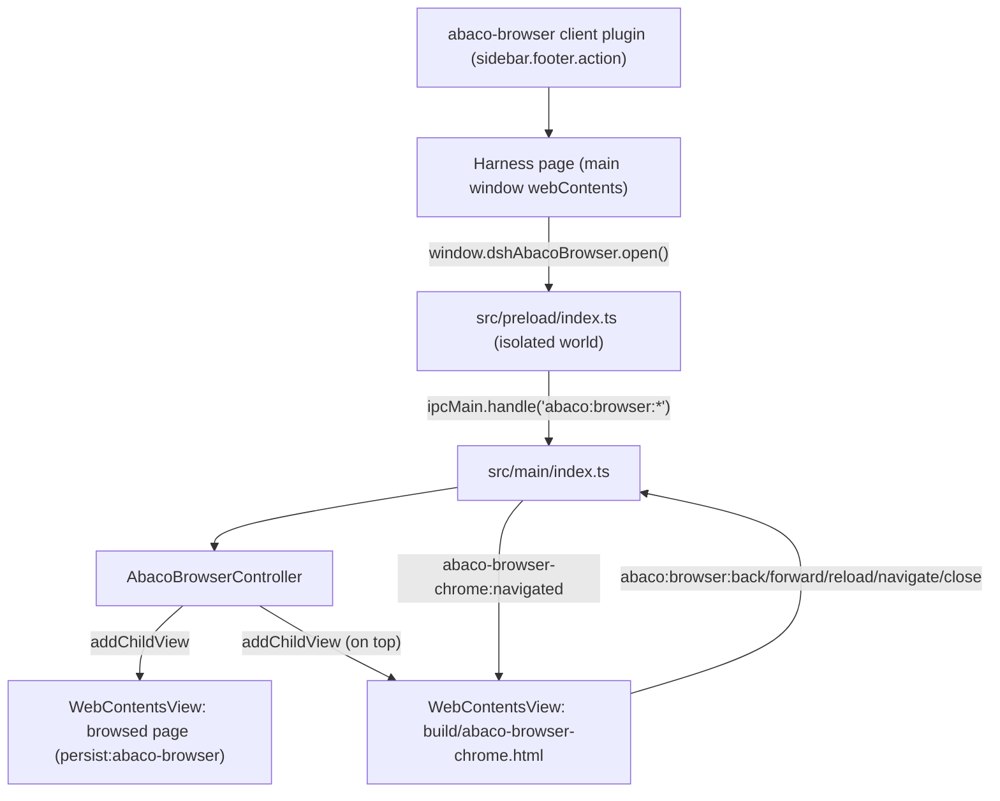

# Integrated browser (ABACO browser, F0)

F0 ships the smallest end-to-end slice of the integrated browser: a launcher in
the sidebar footer, an overlay `WebContentsView` inside the main window, a basic
chrome bar, and the IPC/preload seam between them.

Status: implemented, statically verified (`npm run typecheck` → 0 errors,
`node --check` on the client plugin, profile-closure invariants asserted). No
Electron build or app launch was run for F0.

## Topology

The chat is never touched: the Harness renderer stays the window's own
`webContents`, and the overlay is added as sibling child views through
`window.contentView.addChildView(...)` — the mechanism `safe-mode-overlay.ts`
already uses for its backdrop and `attachWindowsMenuView` for the Windows menu.

## Files

| Path | Role |
| --- | --- |
| `src/shared/abaco-browser.ts` | Channel names, partition, chrome height, URL normalization (shared by main and both preloads) |
| `src/main/abaco-browser-controller.ts` | Owns both overlay views, navigation commands, bounds sync, view-level security handlers |
| `src/main/index.ts` | Creates one controller per main window, registers the `abaco:browser:*` handlers and the sender guard |
| `src/preload/index.ts` | Exposes `window.dshAbacoBrowser` on the Harness page |
| `src/preload/abaco-browser-chrome.ts` | Wires the chrome bar DOM to the same channels |
| `build/abaco-browser-chrome.html` | Chrome bar markup + styles (inert document, no page script) |
| `packages/abaco-browser/` | `sidebar.footer.action` launcher client plugin (inert host half) |

Mounting touches the same three places as every desktop plugin: a row in
`build/dsh-desktop.patch.yml`, a `file:packages/abaco-browser` dependency in the
fork manifest, and a `+ "abaco-browser": "0.1.0"` line in
`patches/@deepseek-ai+dsh+0.1.2-rc.1.patch` (the profile resolves plugins through
`@deepseek-ai/dsh`'s dependency closure, not through the app's own
`node_modules`).

## Decisions taken in F0

### The chrome bar is a child view, not injected DOM

The alternative was to inject a fixed-position bar into the Harness page with
`webContents.executeJavaScript` (or from the preload) and have it call
`window.dshAbacoBrowser.*`. F0 chose a local `WebContentsView`
(`build/abaco-browser-chrome.html` + `abaco-browser-chrome.cjs`, added *after*
the page view so it paints on top), for three reasons:

1. **Lifetime.** The Harness page can navigate or be reloaded (renderer
   recovery, auth refresh). Injected DOM would disappear while the overlay keeps
   covering the window, leaving a browser with no visible controls — the
   launcher is underneath the overlay, so the user could not even close it. A
   child view survives page navigation and keeps its own close button.
2. **Input isolation.** `src/preload/index.ts` installs document-level
   `keydown`/DOM observers for its update UI. An address input living in that
   document shares them; the chrome bar's own `webContents` has its own focus
   and keyboard scope, so typing in the address bar can never fight the shell.
3. **Precedent.** `attachWindowsMenuView` already proves the pattern in this
   codebase: a local HTML shell, a dedicated preload entry in
   `electron.vite.config.ts`, and a `build/*.html` copy in `extraResources`.

Cost: one preload entry, one static HTML file and one `extraResources` mapping.

### F0 geometry: page full-window, opaque strip on top

`syncBounds()` gives the page view the whole content rect and lays the opaque
44px chrome strip over its first rows (`ABACO_BROWSER_CHROME_HEIGHT`). This is
the "covers the whole window, chrome on top" behaviour chosen for F0: bounds stay
a pure function of the window size (nothing to get wrong on resize or fullscreen
transitions), and the page staying alive under the strip is the seam a
translucent/animated strip would need later. The strip leaves a `darwin`-only
left gutter so the native traffic lights stay clickable; window dragging while
the overlay is open is a F2 concern.

### Security boundary

- The browsed page gets its **own session partition** (`persist:abaco-browser`):
  it can never read the Harness cookie, storage or cache.
- The page view is **not** passed through `secureWindow()` — browsing *is*
  external navigation. Instead the controller installs a narrower policy:
  `setWindowOpenHandler` denies new windows and loads the target in the same
  view, main-frame `will-navigate` refuses anything that is not `http(s)` (or
  `about:blank`), and the partition's session denies every permission request
  and check.
- Downloads are cancelled in F0: an arbitrary page must not drop files on disk
  with no UI to track them.
- Both overlay views run `contextIsolation: true`, `sandbox: true`,
  `nodeIntegration: false`, `webSecurity: true`.
- IPC guard: `abaco:browser:*` accepts only the Harness main frame or the
  overlay's own chrome-bar frame. The browsed page has no preload and no route
  back into the shell; the Harness page's power is limited to what the visible
  browser can already do (open/close/navigate/reload).

## Backlog

- **F1 — chrome and agent surface.** Keep the overlay alive across close/open
  (history and scroll preserved), editable/loading-aware address bar, download
  surface instead of cancelled downloads, follow the Harness theme (not just
  `prefers-color-scheme`) through a `theme-changed` push, and a host-side seam so
  the agent (or a tool) can open a URL in the overlay through the same
  controller.
- **F2 — window integration.** Draggable strip (`-webkit-app-region` on the
  chrome view), traffic-light-aware layout on macOS, keyboard shortcuts
  (⌘L/⌘R/⌘W/⌘←), find-in-page, zoom controls, per-tab history.
- **F3 — tabs and persistence.** Multiple page views with a tab strip, reopen
  the last session, bookmarks/history storage in the `abaco-browser` partition,
  and a settings section for the browser (home page, downloads, permissions).
