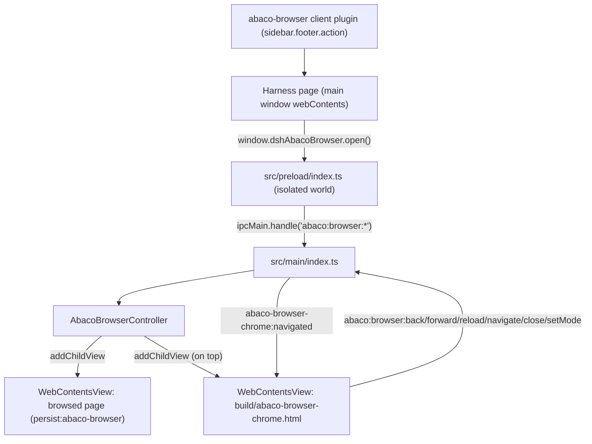

# Integrated browser (ABACO browser, F0 + F1)

F0 ships the smallest end-to-end slice of the integrated browser: a launcher in
the sidebar footer, an overlay `WebContentsView` inside the main window, a basic
chrome bar, and the IPC/preload seam between them.

F1 gives the **agent** the same browser: seven `abaco_browser_*` tools that
navigate, click, type, read the DOM, wait for selectors, screenshot and report
state — reaching the main process' overlay across a process boundary through a
loopback HTTP control plane, with an explicit agent/manual ownership switch.

Status: implemented, statically verified (`npm run typecheck` → 0 errors,
`node --check` on both plugin halves, `npx vitest run test/abaco-browser.test.ts`
→ 22/22). No Electron build or app launch was run for F0 or F1.

## Topology

The chat is never touched: the Harness renderer stays the window's own
`webContents`, and the overlay is added as sibling child views through
`window.contentView.addChildView(...)` — the mechanism `safe-mode-overlay.ts`
already uses for its backdrop and `attachWindowsMenuView` for the Windows menu.

## F1 topology

The agent's tools live in the **Harness Node child** (that is where `ctx.tools`
is); the overlay lives in **Electron main** (only it may create a
`WebContentsView`). Neither F0's renderer preload nor an IPC channel bridges
those two, so F1 adds a third surface:

```mermaid
flowchart LR
  TOOLS["abaco-browser plugin host half (Harness Node child):<br/>7 defineTool definitions"] -->|"POST /navigate /click /type /read-dom /wait-for /screenshot /state<br/>Authorization: Bearer token"| RPC["AbacoBrowserRpcServer<br/>127.0.0.1:&lt;ephemeral&gt;"]
  RPC --> GATE{"mode?"}
  GATE -->|agent| CTRL["AbacoBrowserController.agent*"]
  GATE -->|manual| REFUSE["409 + takeover message"]
  CTRL -->|"executeJavaScript / capturePage"| OVERLAY["browsed page"]
  MAIN["src/main/index.ts (bootstrap)"] -->|"start() before launchHarness()"| RPC
  MAIN -->|"extraEnvironment: () =&gt; rpc.environment()"| SPAWN["HarnessRuntime spawn"]
  SPAWN -->|"ABACO_BROWSER_CTRL_PORT / _TOKEN in child env"| TOOLS
```

Why HTTP on loopback rather than more IPC: the consumer is a **Node child**, not
a renderer, so there is no `ipcRenderer` to hand it and no way to add one. The
precedent is `mobile/lan-mobile-bridge.ts`, which already runs a loopback server
in main for the same reason (its client is a phone browser).

## Files

| Path | Role |
| --- | --- |
| `src/shared/abaco-browser.ts` | Channel names, partition, chrome height, URL normalization, and the F1 contract: mode, agent result types, control-plane env names, RPC routes (shared by main and both preloads) |
| `src/main/abaco-browser-controller.ts` | Owns both overlay views, navigation commands, bounds sync, view-level security handlers, the takeover gate and the `agent*` actions |
| `src/main/abaco-browser-page-scripts.ts` | The page-side bodies (`click`, `type`, `read-dom`, `wait-for`) as real TypeScript functions, serialized with `Function.prototype.toString()` |
| `src/main/abaco-browser-rpc.ts` | Loopback control plane: ephemeral port, per-launch bearer token, one route per agent tool |
| `src/main/index.ts` | Creates one controller per main window, registers the `abaco:browser:*` handlers and the sender guard, starts/stops the RPC server, hands its env to the runtime |
| `src/main/runtime/harness-runtime.ts` | `extraEnvironment` option, merged into the child's env at every spawn |
| `src/preload/index.ts` | Exposes `window.dshAbacoBrowser` on the Harness page (read-only `mode()`) |
| `src/preload/abaco-browser-chrome.ts` | Wires the chrome bar DOM — including the F1 mode switch — to the same channels |
| `build/abaco-browser-chrome.html` | Chrome bar markup + styles (inert document, no page script) |
| `packages/abaco-browser/index.js` | Host half: the seven `abaco_browser_*` tools over the control plane |
| `packages/abaco-browser/client.js` | Client half: `sidebar.footer.action` launcher |
| `test/abaco-browser.test.ts` | F0 structural invariants + F1 control plane, tool schemas and page-script tests |

Mounting touches the same three places as every desktop plugin: a row in
`build/dsh-desktop.patch.yml`, a `file:packages/abaco-browser` dependency in the
fork manifest, and a `+ "abaco-browser": "0.1.0"` line in
`patches/@deepseek-ai+dsh+0.1.2-rc.1.patch` (the profile resolves plugins through
`@deepseek-ai/dsh`'s dependency closure, not through the app's own
`node_modules`).

## Decisions taken in F0

### The chrome bar is a child view, not injected DOM

The alternative was to inject a fixed-position bar into the Harness page with
`webContents.executeJavaScript` (or from the preload) and have it call
`window.dshAbacoBrowser.*`. F0 chose a local `WebContentsView`
(`build/abaco-browser-chrome.html` + `abaco-browser-chrome.cjs`, added *after*
the page view so it paints on top), for three reasons:

1. **Lifetime.** The Harness page can navigate or be reloaded (renderer
   recovery, auth refresh). Injected DOM would disappear while the overlay keeps
   covering the window, leaving a browser with no visible controls — the
   launcher is underneath the overlay, so the user could not even close it. A
   child view survives page navigation and keeps its own close button.
2. **Input isolation.** `src/preload/index.ts` installs document-level
   `keydown`/DOM observers for its update UI. An address input living in that
   document shares them; the chrome bar's own `webContents` has its own focus
   and keyboard scope, so typing in the address bar can never fight the shell.
3. **Precedent.** `attachWindowsMenuView` already proves the pattern in this
   codebase: a local HTML shell, a dedicated preload entry in
   `electron.vite.config.ts`, and a `build/*.html` copy in `extraResources`.

Cost: one preload entry, one static HTML file and one `extraResources` mapping.

### F0 geometry: page full-window, opaque strip on top

`syncBounds()` gives the page view the whole content rect and lays the opaque
44px chrome strip over its first rows (`ABACO_BROWSER_CHROME_HEIGHT`). This is
the "covers the whole window, chrome on top" behaviour chosen for F0: bounds stay
a pure function of the window size (nothing to get wrong on resize or fullscreen
transitions), and the page staying alive under the strip is the seam a
translucent/animated strip would need later. The strip leaves a `darwin`-only
left gutter so the native traffic lights stay clickable; window dragging while
the overlay is open is a F2 concern.

### Security boundary

- The browsed page gets its **own session partition** (`persist:abaco-browser`):
  it can never read the Harness cookie, storage or cache.
- The page view is **not** passed through `secureWindow()` — browsing *is*
  external navigation. Instead the controller installs a narrower policy:
  `setWindowOpenHandler` denies new windows and loads the target in the same
  view, main-frame `will-navigate` refuses anything that is not `http(s)` (or
  `about:blank`), and the partition's session denies every permission request
  and check.
- Downloads are cancelled in F0: an arbitrary page must not drop files on disk
  with no UI to track them.
- Both overlay views run `contextIsolation: true`, `sandbox: true`,
  `nodeIntegration: false`, `webSecurity: true`.
- IPC guard: `abaco:browser:*` accepts only the Harness main frame or the
  overlay's own chrome-bar frame. The browsed page has no preload and no route
  back into the shell; the Harness page's power is limited to what the visible
  browser can already do (open/close/navigate/reload).

## Decisions taken in F1

### The control plane is an HTTP loopback server, not more IPC

The agent's tool runs in the Harness Node child; the overlay is an Electron
`WebContentsView`. There is no IPC channel across that boundary — `ipcRenderer`
belongs to renderers, and the child is not one — so F1 pays for a small HTTP
server instead of pretending a renderer seam can reach a Node process.

What that buys:

- **No configuration and no fixed port.** `listen(0, '127.0.0.1')` lets the OS
  assign the port; nothing is written to a settings file, and two windows (or a
  second instance of the app) cannot collide on it.
- **The credential travels in the process's own environment.** The token is 32
  random bytes minted per launch, sent as `Authorization: Bearer …`, compared
  with `timingSafeEqual`, and merged into the child's env by
  `buildHarnessSpawnOptions` — so it is never on a command line, in a log, or on
  disk.
- **The socket is not on the network.** The listener binds the literal
  `127.0.0.1` (never `0.0.0.0`, never the name `localhost`, which can resolve to
  a wildcard), and the handler re-checks the peer address. A browsed page that
  guessed the port still has no token.

### The tool half fails loudly instead of disappearing

`packages/abaco-browser/index.js` reads the port and token from
`process.env[ABACO_BROWSER_CTRL_PORT]` / `…_TOKEN`. When either is missing — an
older shell, a standalone harness, a launch where the listener failed to bind —
the tools still register and every call answers with one sentence explaining
that the desktop shell did not provide a control endpoint. A tool that vanished
from the model's tool list would be far harder to diagnose than one that
explains itself.

Because the plugin is a separate package resolved inside the Harness profile, it
cannot import `src/shared/abaco-browser.ts`; the two environment names and the
route names are therefore restated there, and
`test/abaco-browser.test.ts` asserts the two copies still agree.

### Page scripts are TypeScript functions, serialized

`webContents.executeJavaScript` takes *source text*. F1's bodies
(`clickInPage`, `typeInPage`, `readDomInPage`, `waitForInPage`) are ordinary
Functions in `abaco-browser-page-scripts.ts` that the controller serializes with
`Function.prototype.toString()`, for one reason: they stay under `tsc`, with the
DOM lib in scope, so a misspelled DOM API or a wrong `KeyboardEventInit` field
fails `npm run typecheck` instead of failing silently inside a remote page.

The rule that makes this sound is that **a page body references no enclosing
scope** — `String(fn)` carries the body and nothing else, so a free variable
(name, helper, import) would be a `ReferenceError` in the page. Everything
arrives as an argument, which is why the selector-polling loop is duplicated
verbatim in four bodies rather than shared.

Two details the bodies care about, both learned from real pages:

- `type` writes through the field's **prototype** `value` setter, not
  `element.value = …`: React and Vue install their own accessor on the instance,
  so a direct assignment leaves framework state stale and the next render wipes
  the text.
- `click` dispatches the pointer/mouse sequence and *then* `.click()`, because
  design systems key off `pointerdown` while plain links key off `click`.

### Takeover is an explicit flag, not an inference

`AbacoBrowserController` carries `mode: 'agent' | 'manual'`, defaulting to
`agent`. Every mutating `agent*` action passes `requireAgentControl()` and is
refused with `ABACO_BROWSER_TAKEOVER_MESSAGE` while the mode is `manual`; the RPC
server turns that into a `409`. The user flips it from the chrome bar's mode
pill, through the two new IPC channels `abaco:browser:mode` / `:setMode`.

Three deliberate asymmetries:

- **The agent can read the mode but never write it.** There is no RPC route that
  changes it, and the Harness-page bridge exposes `mode()` but not `setMode()`,
  so a runaway tool cannot lift the gate that just refused it.
- **`abaco_browser_state` is never gated.** A gated state would report the same
  failure for "the user has the wheel" and "the overlay is closed"; the model
  needs to tell those apart to say anything useful.
- **Clicking around the page is not treated as a takeover.** Inferring ownership
  from stray events would silently strand a running agent mid-task. The pill is
  the whole switch, and the controller re-publishes the mode after every change,
  so the strip cannot lie about who owns the page.

### Screenshots come back as a path

`agentScreenshot()` rasterizes the view with `capturePage()` and returns the PNG
bytes; the tool half writes them under
`$DSH_HOME/abaco-browser/screenshots/` and returns the path. Base64 in a tool
result would cost hundreds of kilobytes of context and still not be an image the
model can see, whereas a path can be handed to `read_image`, which already knows
how to show one. A write failure downgrades to dimensions-only rather than
failing a capture that actually succeeded.

## Backlog

- **F1 — chrome and agent surface. Done** (see above), except the two items that
  were never about the agent: keeping the overlay alive across close/open
  (history and scroll preserved), a download surface instead of cancelled
  downloads, and following the Harness theme (not just `prefers-color-scheme`)
  through a `theme-changed` push. Those move to F2.
- **F2 — window integration.** Draggable strip (`-webkit-app-region` on the
  chrome view), traffic-light-aware layout on macOS, keyboard shortcuts
  (⌘L/⌘R/⌘W/⌘←), find-in-page, zoom controls, per-tab history, overlay lifetime
  across close/open, a download surface, and theme following.
- **F3 — tabs and persistence.** Multiple page views with a tab strip, reopen
  the last session, bookmarks/history storage in the `abaco-browser` partition,
  and a settings section for the browser (home page, downloads, permissions).
